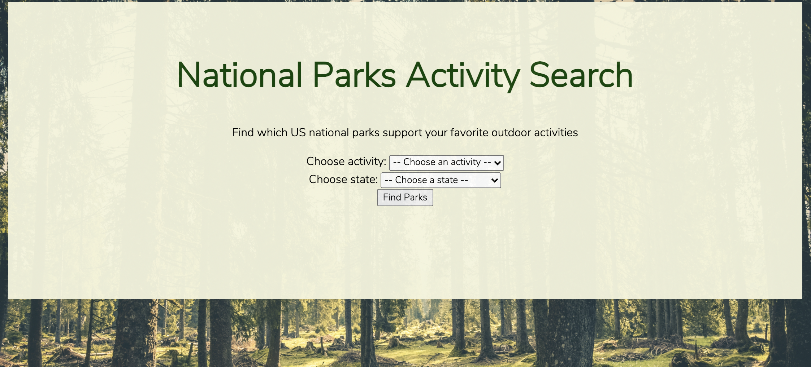
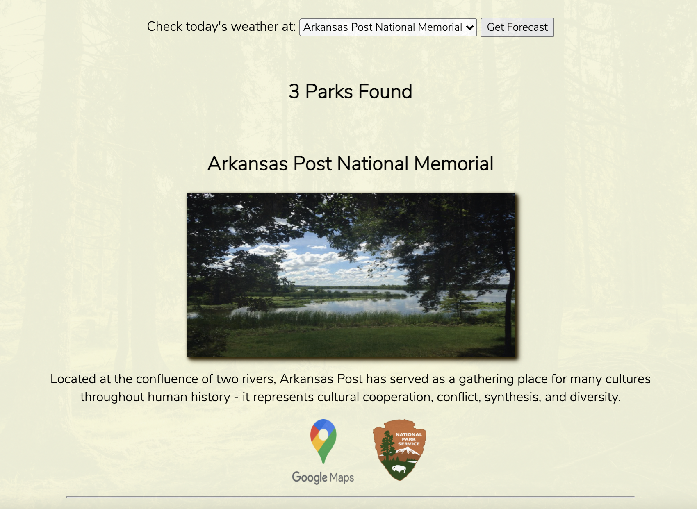
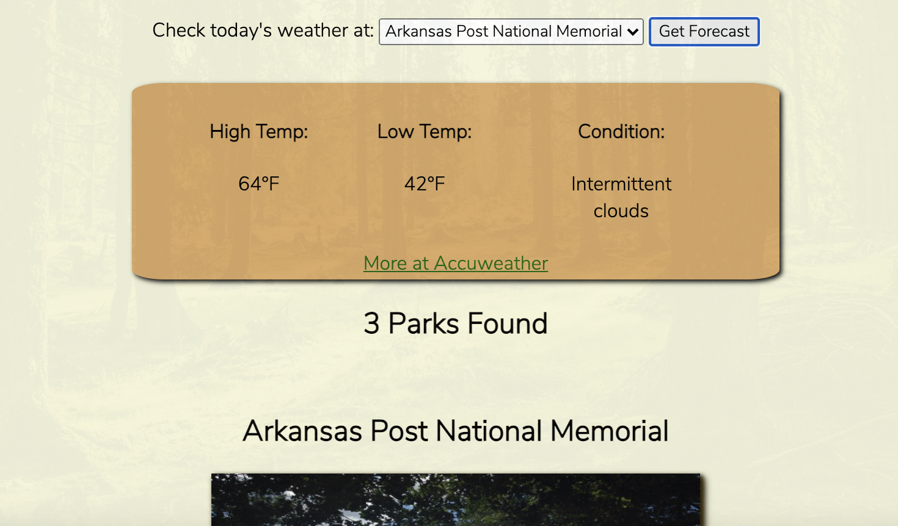

<h1>National Parks Activity Search</h1>

<h2>Summary</h2>

This app helps users find which national parks support their favorites outdoor activities.

After selecting an activity and state, the user sees a list of national parks that match their search criteria (provided by the National Parks API). Each park result shows the park name, a picture, description, Google Maps link and NPS.gov link. The user can also view the day's weather forecast for each resulted park (provided by the Accuweather APIs) at the top of the page.

<h2>See It Live</h2>
<a href='https://sabrinasides.github.io/NationalParksActivitySearch' target='_blank'>National Parks Activity Search</a>

<h2>Screenshots</h2>

<h2>Tech Used</h2>
<h3>APIs</h3>
<ul>
  <li><a href='https://www.nps.gov/subjects/developer/api-documentation.htm#/parks/getPark' target='_blank'>National Parks Service</a></li>
  <li><a href='https://developer.accuweather.com/accuweather-locations-api/apis/get/locations/v1/cities/geoposition/search' target='_blank'>AccuWeather         Geoposition</a></li>
  <li><a href='https://developer.accuweather.com/accuweather-forecast-api/apis/get/forecasts/v1/daily/1day/%7BlocationKey%7D' target='_blank'>AccuWeather 1     Day Forecast</a></li>
  </ul>

<h3>Languages</h3>
<ul>
  <li>HTML</li>
  <li>CSS</li>
  <li>JavaScript</li>
  <li>jQuery</li>
  </ul>
